# Evidências de execução na AWS

Os notebooks em `notebooks/` rodam localmente por padrão (mais simples pra
desenvolver e depurar). A execução real na nuvem, que o desafio pede
explicitamente, foi feita a partir dos scripts em [`glue_jobs/`](../glue_jobs/),
publicados como **AWS Glue Jobs**, lendo/escrevendo direto no **Amazon S3**,
catalogados no **Glue Data Catalog** e consultados via **Amazon Athena**.

Como o AWS Academy Lab usa credenciais temporárias (sessão expira em ~4h,
sem acesso persistente fora da aula), a evidência abaixo é por captura de
tela, feita no momento de cada execução — não por link ao vivo.

---

## 1. Glue Jobs — execução do pipeline

<!-- Print da aba "Runs" do Glue Studio de cada Job, mostrando status
     Succeeded, duração e timestamp. Um bloco por edição/camada rodada. -->

### Bronze

| Edição | Status | Data | Duração |
| :--- | :--- | :--- | :--- |
| **bronze-2023-teste** | Succeeded | 08/10/2026 | 2m 23s |
| **bronze-2024-teste** | Succeeded | 23/08/2026 | 1m 42s |
| **bronze-2025-2026-teste** | Succeeded | 22/08/2026 | 2m 17s |

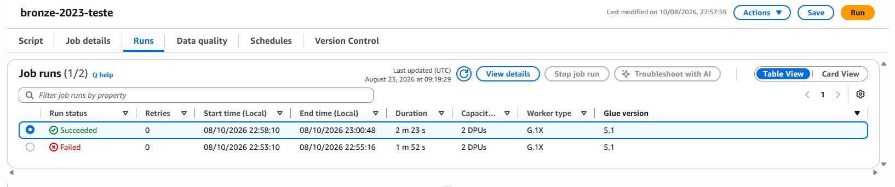
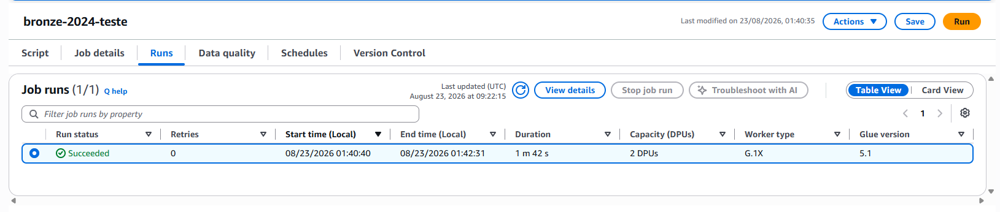
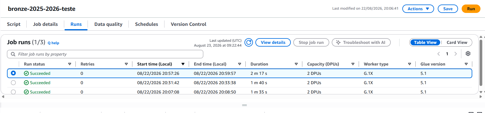

### Silver

| Edição | Status | Data | Duração |
| :--- | :--- | :--- | :--- |
| **silver-2023-teste** | Succeeded | 08/10/2026 | 2m |
| **silver-2024-teste** | Succeeded | 23/08/2026 | 2m 26s |
| **silver-2025-final** | Succeeded | 22/08/2026 | 2m 50s |

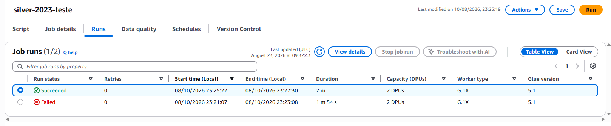
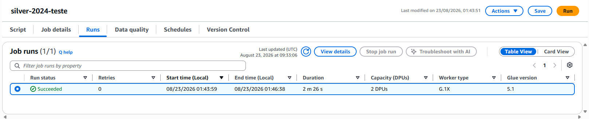
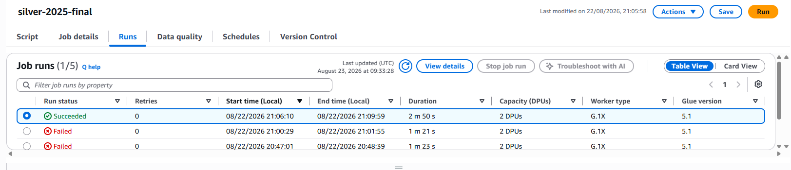

### Gold

| Edição | Status | Data | Duração |
| :--- | :--- | :--- | :--- |
| **gold-2023-teste** | Succeeded | 08/10/2026 | 2m 58s |
| **gold-2024-teste** | Succeeded | 23/08/2026 | 3m 10s |
| **gold-2025-final** | Succeeded | 22/08/2026 | 3m 10s |

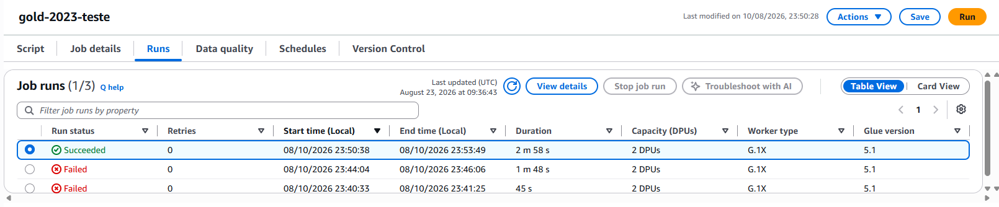
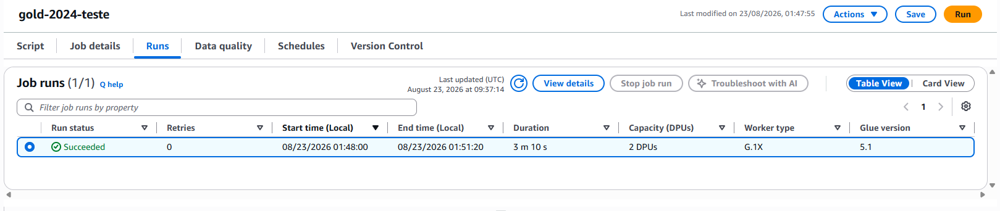
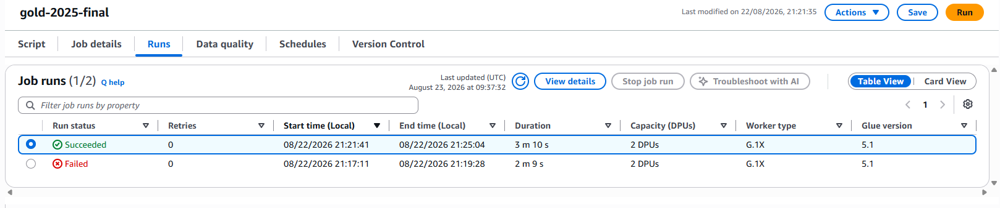

---

## 2. Amazon S3 — Data Lake particionado

<!-- Print do console do S3 mostrando a árvore de pastas com as partições
     ano_pesquisa=2023 / 2024 / 2025 populadas em cada camada. -->

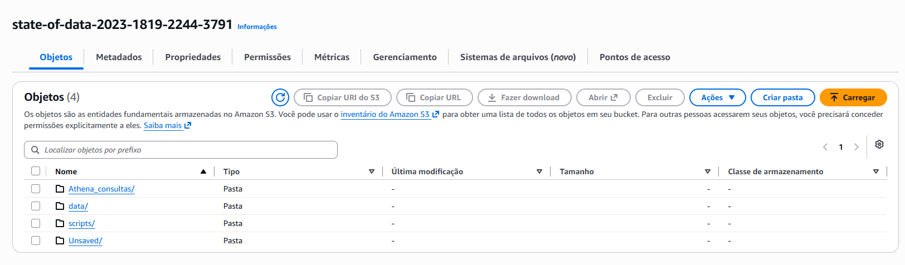

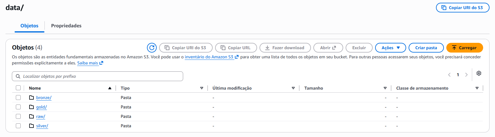

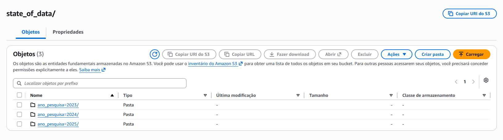

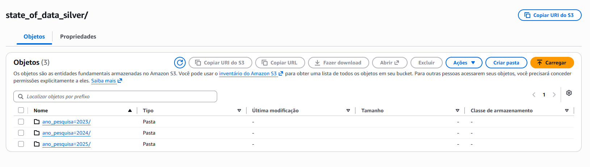

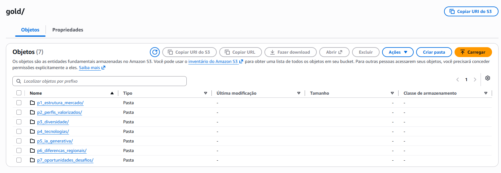

---

## 3. AWS Glue Data Catalog — catalogação

<!-- Print da lista de tabelas catalogadas (crawler ou catalogação manual),
     mostrando o schema reconhecido a partir do Parquet da Gold. -->

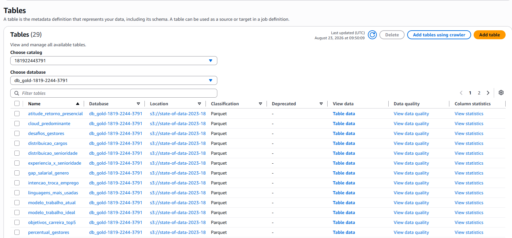

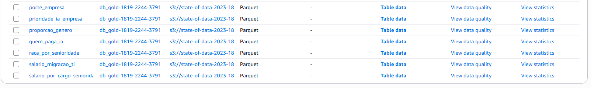

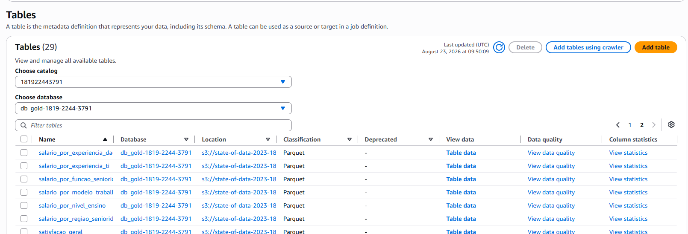

---

## 4. Amazon Athena — consultas analíticas

<!-- Print de uma query rodando contra as tabelas catalogadas, com
     resultado visível. Se possível, usar uma das queries comparativas
     entre as 3 edições (ex: SELECT ano_pesquisa, ... GROUP BY ano_pesquisa). -->

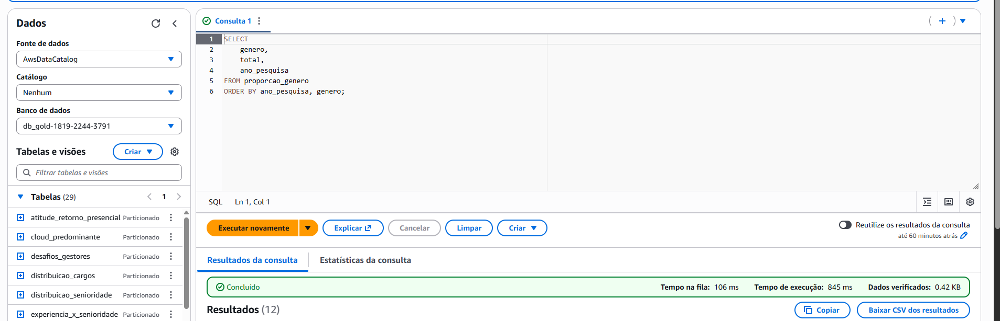
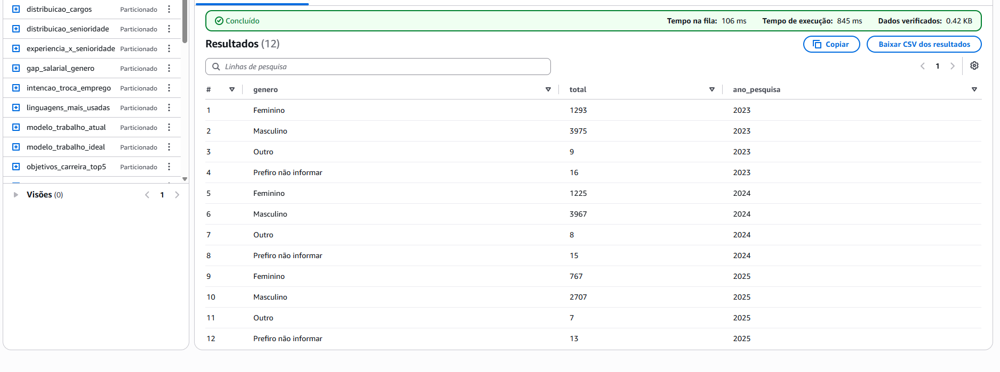

---

## 5. Power BI — consumo final

<!-- Print do dashboard conectado via Athena, mostrando os dados das
     3 edições. -->

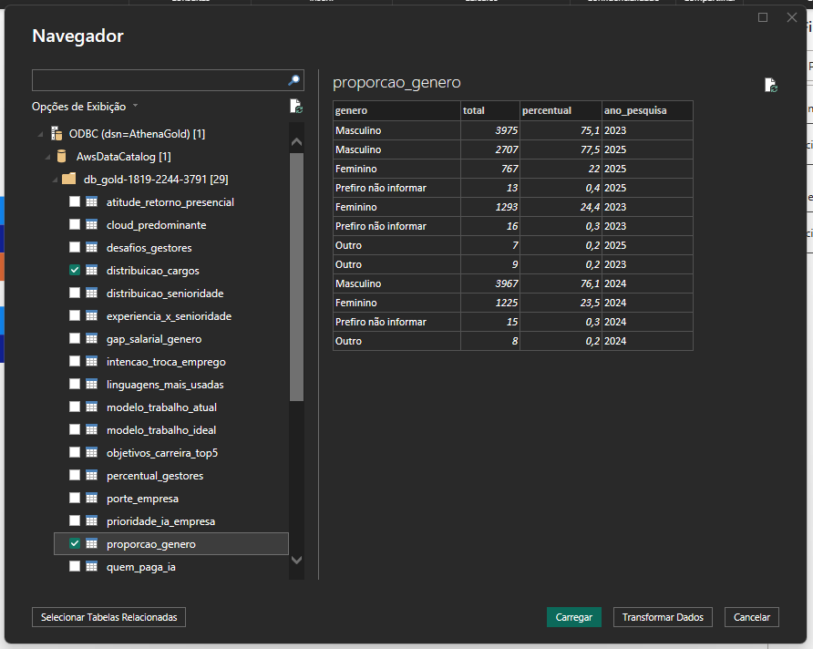

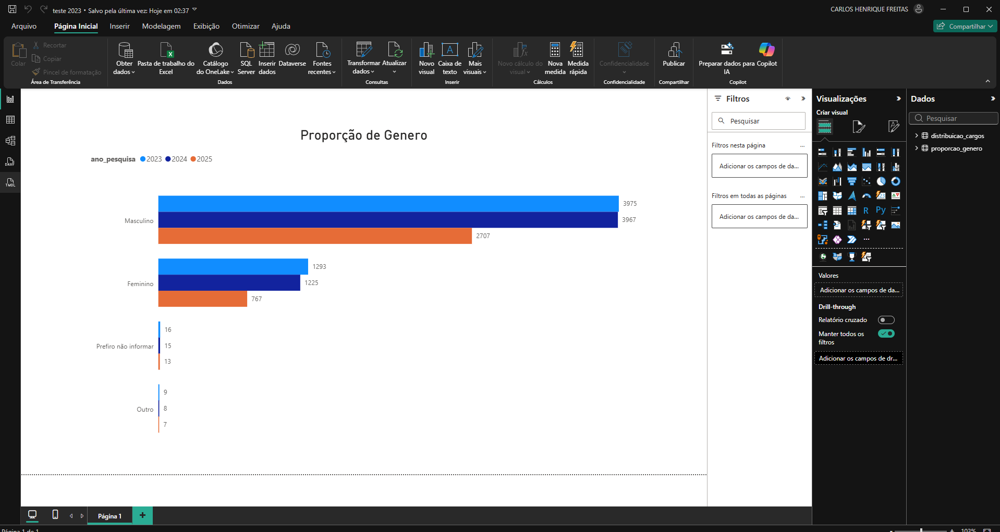

---

## Resumo

- Pipeline completo (Bronze → Silver → Gold) executado como **Glue Job**
  para as 3 edições, com overwrite dinâmico por partição `ano_pesquisa`.
- Dado catalogado no **Glue Data Catalog** e consultável via **Amazon Athena**.
- Consumo final em **Power BI**, conectado via Athena.

